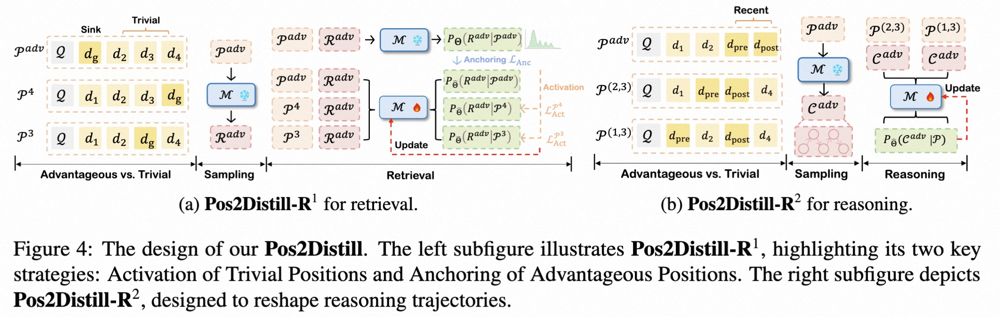

# Pos2Distill :camera:
**OFFICIAL CODE [[paper](https://arxiv.org/abs/2508.15709)]** for paper "POSITION BIAS MITIGATES POSITION BIAS: Mitigate Position Bias Through Inter-Position Knowledge Distillation " (EMNLP2025 Main)



## TL;DR
**Pos2Distill** is a novel position to position knowledge distillation framework, transferring knowledge from advantageous positions to rectify responses at unfavorable ones, therefore mitigating position bias naturally.

## Usage
Updating soon ...

## Citation
If you feel this project is helpful, please consider cite our report :blush:
```
@article{wang2025position,
  title={Position Bias Mitigates Position Bias: Mitigate Position Bias Through Inter-Position Knowledge Distillation},
  author={Wang, Yifei and Xiong, Feng and Wang, Yong and Li, Linjing and Chu, Xiangxiang and Zeng, Daniel Dajun},
  journal={arXiv preprint arXiv:2508.15709},
  year={2025}
}
```
